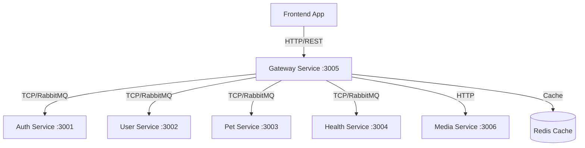
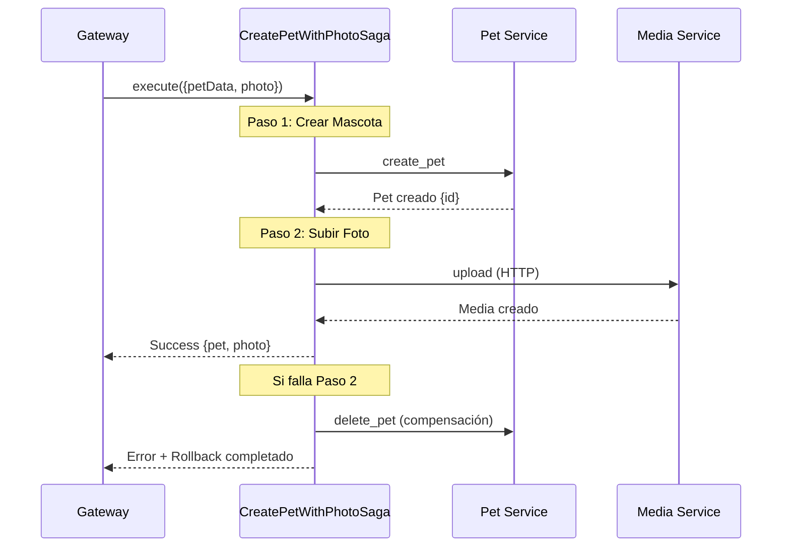
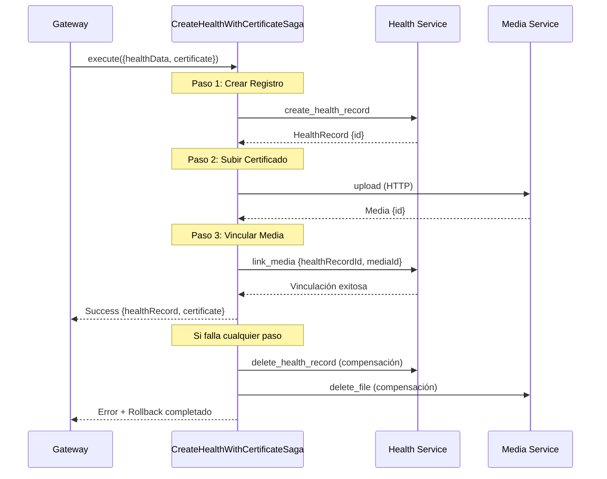
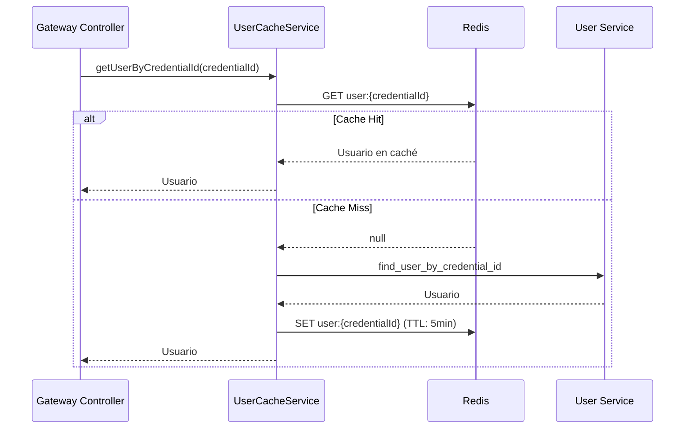
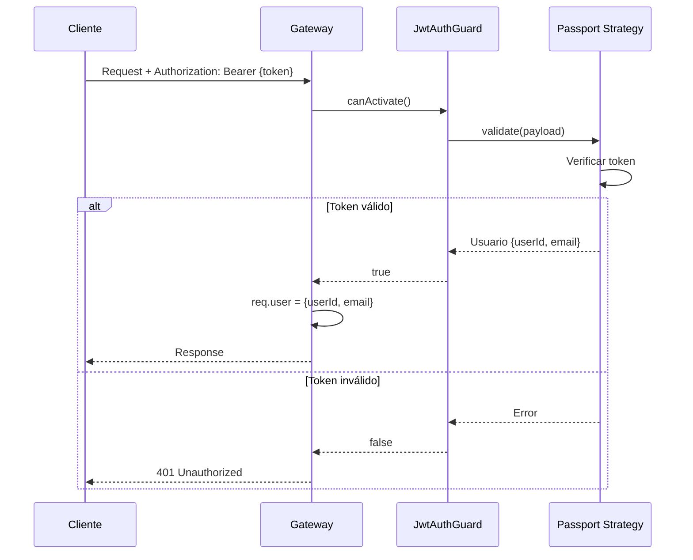
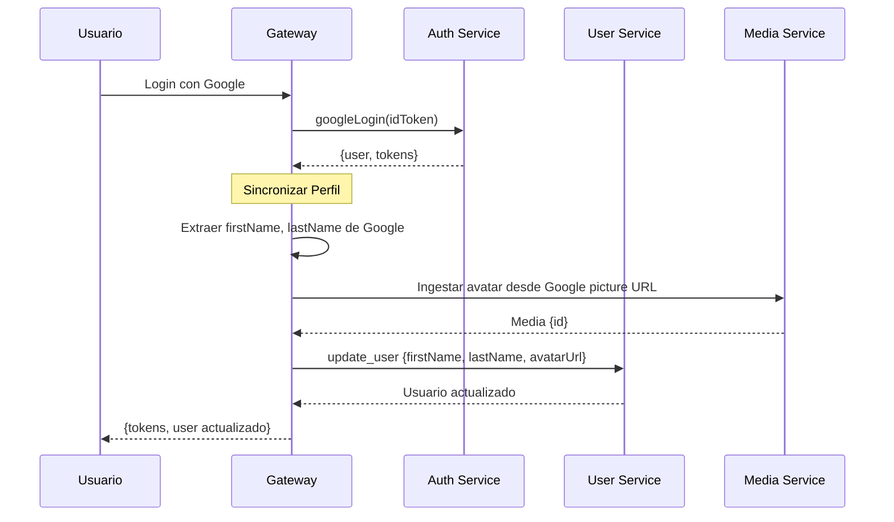

# Gateway Service

## Descripción

Servicio de API Gateway para la aplicación "Libreta Sanitaria de Mascotas". Actúa como punto de entrada único para todas las peticiones del frontend, orquestando llamadas a múltiples microservicios, implementando patrones Saga para transacciones distribuidas, y manejando autenticación JWT.

## Tecnologías

- **Framework**: NestJS
- **Autenticación**: JWT (Passport)
- **Mensajería**: RabbitMQ (ClientProxy)
- **Cache**: Redis (para datos de usuario y mascotas)
- **HTTP Client**: Axios (para Media Service)
- **Validación**: class-validator

## Arquitectura



## Responsabilidades

1. **Enrutamiento**: Dirige peticiones a los microservicios correspondientes
2. **Autenticación**: Valida tokens JWT en cada petición
3. **Autorización**: Verifica permisos de usuario
4. **Orquestación**: Coordina llamadas a múltiples servicios
5. **Sagas**: Implementa transacciones distribuidas con compensación
6. **Cache**: Optimiza rendimiento con caché de datos frecuentes
7. **Transformación**: Adapta respuestas para el frontend
8. **Manejo de Errores**: Centraliza manejo de errores y excepciones

---

## Patrones de Diseño

### 1. API Gateway Pattern

**Propósito**: Punto de entrada único para todas las peticiones del cliente.

**Beneficios**:
- Simplifica el cliente (una sola URL)
- Reduce latencia (menos round-trips)
- Centraliza autenticación y autorización
- Facilita versionado de API

---

### 2. Saga Pattern

**Propósito**: Gestionar transacciones distribuidas con compensación automática.

**Implementación**: Patrón Saga Orquestado (Orchestration-based Saga)

**Sagas Implementadas**:

#### SAGA-01: CreatePetWithPhotoSaga

**Objetivo**: Crear mascota con foto de forma atómica

**Pasos**:
1. **Crear Mascota**: Pet Service crea registro de mascota
2. **Subir Foto**: Media Service almacena foto

**Compensación**:
- Si falla paso 2: Eliminar mascota creada en paso 1

**Diagrama de Flujo**:



**Resiliencia**:
- Timeout: 3000ms por paso
- Reintentos: 2 intentos con delay incremental (300ms, 600ms)

---

#### SAGA-02: CreateHealthWithCertificateSaga

**Objetivo**: Crear registro de salud con certificado de forma atómica

**Pasos**:
1. **Crear Registro**: Health Service crea registro de salud
2. **Subir Certificado**: Media Service almacena certificado
3. **Vincular Media**: Health Service vincula media al registro

**Compensación**:
- Si falla paso 3: Eliminar certificado y registro
- Si falla paso 2: Eliminar registro creado

**Diagrama de Flujo**:



**Resiliencia**:
- Timeout: 3000ms por paso
- Reintentos: 2 intentos con delay incremental (300ms, 600ms)

---

### 3. Cache-Aside Pattern

**Propósito**: Optimizar rendimiento reduciendo llamadas a microservicios.

**Implementación**: `UserCacheService`

**Flujo**:



**Invalidación de Caché**:
- Al actualizar usuario: `invalidateUser(credentialId)`
- Al actualizar mascota: `invalidatePet(petId)`
- Al eliminar: Invalidar caché correspondiente

---

## Endpoints Principales

### Autenticación

| Método | Endpoint | Descripción | Auth |
|--------|----------|-------------|------|
| POST | `/auth/register` | Registrar usuario | ❌ |
| POST | `/auth/login` | Iniciar sesión | ❌ |
| POST | `/auth/google` | Login con Google | ❌ |
| POST | `/auth/refresh` | Renovar token | ❌ |
| POST | `/auth/logout` | Cerrar sesión | ✅ |
| PATCH | `/auth/credentials` | Actualizar credenciales | ✅ |
| POST | `/auth/forgot-password` | Solicitar recuperación | ❌ |
| POST | `/auth/reset-password` | Restablecer contraseña | ❌ |
| POST | `/auth/google/link` | Vincular Google | ✅ |
| DELETE | `/auth/google/unlink` | Desvincular Google | ✅ |
| GET | `/auth/provider-info` | Info de proveedores | ✅ |

### Usuarios

| Método | Endpoint | Descripción | Auth |
|--------|----------|-------------|------|
| GET | `/users/me` | Obtener mi perfil | ✅ |
| PATCH | `/users/:id` | Actualizar usuario | ✅ |
| POST | `/users/me/avatar` | Subir avatar | ✅ |
| DELETE | `/users/me/avatar` | Eliminar avatar | ✅ |

### Mascotas

| Método | Endpoint | Descripción | Auth |
|--------|----------|-------------|------|
| POST | `/pets` | Crear mascota | ✅ |
| POST | `/pets/with-photo` | Crear con foto (Saga) | ✅ |
| GET | `/pets` | Listar mis mascotas | ✅ |
| GET | `/pets/:id` | Obtener mascota | ✅ |
| PATCH | `/pets/:id` | Actualizar mascota | ✅ |
| DELETE | `/pets/:id` | Eliminar mascota | ✅ |

### Salud

| Método | Endpoint | Descripción | Auth |
|--------|----------|-------------|------|
| POST | `/health` | Crear registro | ✅ |
| POST | `/health/with-certificate` | Crear con certificado (Saga) | ✅ |
| GET | `/health` | Listar mis registros | ✅ |
| GET | `/health/pet/:petId` | Listar por mascota | ✅ |
| GET | `/health/:id` | Obtener registro | ✅ |
| PATCH | `/health/:id` | Actualizar registro | ✅ |
| DELETE | `/health/:id` | Eliminar registro | ✅ |

### Media

| Método | Endpoint | Descripción | Auth |
|--------|----------|-------------|------|
| POST | `/media/upload` | Subir archivo | ✅ |
| GET | `/media/:id` | Obtener archivo | ❌ |
| DELETE | `/media/:id` | Eliminar archivo | ✅ |

---

## Autenticación y Autorización

### JWT Guard

**Implementación**: `JwtAuthGuard`

**Flujo**:



**Token Payload**:
```typescript
{
  userId: string;      // credentialId
  email: string;
  iat: number;         // issued at
  exp: number;         // expiration
}
```

---

## Manejo de Errores

### RpcException Handling

**Transformación**:
```typescript
try {
  const result = await lastValueFrom(
    this.clientService.send({ cmd: 'operation' }, data)
      .pipe(timeout(3000))
  );
  return result;
} catch (error) {
  throw new RpcException({
    statusCode: error?.statusCode ?? 500,
    message: error?.message ?? 'Error en microservicio',
  });
}
```

**Códigos de Error Comunes**:
- `400`: Bad Request (validación fallida)
- `401`: Unauthorized (token inválido)
- `403`: Forbidden (sin permisos)
- `404`: Not Found (recurso no existe)
- `500`: Internal Server Error

---

## Cache Service

### UserCacheService

**Métodos**:

```typescript
// Obtener usuario por credentialId (con caché)
async getUserByCredentialId(credentialId: string): Promise<User>

// Obtener mascota por ID (con caché)
async getPetById(petId: string, petClient: ClientProxy): Promise<Pet>

// Invalidar caché de usuario
async invalidateUser(credentialId: string): Promise<void>

// Invalidar caché de mascota
async invalidatePet(petId: string): Promise<void>
```

**Configuración de TTL**:
- Usuario: 5 minutos
- Mascota: 5 minutos

---

## Sincronización de Perfiles

### Sincronización con Google OAuth

**Flujo**:



---

## Configuración de Timeouts

**Timeouts por Servicio**:
```typescript
const TIMEOUT_MS = 3000; // 3 segundos

// Ejemplo de uso
await lastValueFrom(
  this.clientService.send({ cmd: 'operation' }, data)
    .pipe(timeout(TIMEOUT_MS))
);
```

**Reintentos** (en Sagas):
```typescript
retry({ 
  count: 2, 
  delay: (_err, retryCount) => timer((retryCount + 1) * 300) 
})
```

---

## Variables de Entorno

```env
# Server
PORT=3005
NODE_ENV=development

# JWT
JWT_SECRET=your-jwt-secret-key

# Redis
REDIS_HOST=localhost
REDIS_PORT=6379

# RabbitMQ
RABBITMQ_URL=amqp://localhost:5672

# Microservices (RabbitMQ TCP)
AUTH_SERVICE_HOST=localhost
AUTH_SERVICE_PORT=3001

USER_SERVICE_HOST=localhost
USER_SERVICE_PORT=3002

PET_SERVICE_HOST=localhost
PET_SERVICE_PORT=3003

HEALTH_SERVICE_HOST=localhost
HEALTH_SERVICE_PORT=3004

MEDIA_SERVICE_HOST=localhost
MEDIA_SERVICE_PORT=3006

# Media Service (HTTP)
MEDIA_SERVICE_URL=http://localhost:3006
MEDIA_API_KEY=your-media-api-key
```

---

## Instalación y Ejecución

```bash
# Instalar dependencias
npm install

# Modo desarrollo
npm run start:dev

# Modo producción
npm run build
npm run start:prod
```

---

## Puerto

- **3005** (HTTP REST API)

---

## Dependencias Principales

```json
{
  "dependencies": {
    "@nestjs/common": "^10.0.0",
    "@nestjs/microservices": "^10.0.0",
    "@nestjs/jwt": "^10.0.0",
    "@nestjs/passport": "^10.0.0",
    "passport-jwt": "^4.0.0",
    "ioredis": "^5.3.0",
    "rxjs": "^7.8.0"
  }
}
```

---

## Mejores Prácticas Implementadas

1. **Separación de Responsabilidades**: Cada controlador maneja un dominio específico
2. **Inyección de Dependencias**: Uso de DI de NestJS
3. **Validación de DTOs**: Validación automática con class-validator
4. **Manejo de Errores Centralizado**: RpcException para errores de microservicios
5. **Timeouts**: Prevención de llamadas colgadas
6. **Cache**: Reducción de latencia y carga en microservicios
7. **Sagas**: Consistencia en transacciones distribuidas
8. **Logging**: Registro de operaciones importantes
9. **Guards**: Protección de rutas con autenticación
10. **Swagger**: Documentación automática de API (si está habilitado)

---

## Monitoreo y Observabilidad

### Logs Importantes

```typescript
// Inicio de Saga
this.logger.log('Iniciando CreatePetWithPhotoSaga');

// Compensación
this.logger.error('Saga falló, ejecutando compensación');

// Cache
this.logger.log('Cache hit para usuario: {credentialId}');
this.logger.log('Cache miss, consultando User Service');

// Errores
this.logger.error('Error al comunicarse con Pet Service:', error);
```

### Métricas Recomendadas

1. **Latencia de endpoints**: Tiempo de respuesta por endpoint
2. **Tasa de error**: Porcentaje de peticiones fallidas
3. **Cache hit rate**: Porcentaje de aciertos en caché
4. **Saga success rate**: Porcentaje de sagas exitosas
5. **Timeout rate**: Porcentaje de timeouts en microservicios

---

## Escalabilidad

### Horizontal Scaling

- Gateway es stateless (excepto caché en Redis)
- Puede escalar horizontalmente con load balancer
- Redis compartido entre instancias

### Consideraciones

1. **Session Affinity**: No requerida (stateless)
2. **Cache Invalidation**: Usar Redis Pub/Sub para invalidación distribuida
3. **Rate Limiting**: Implementar para prevenir abuso
4. **Circuit Breaker**: Proteger contra fallos en cascada

---

## Seguridad

1. **CORS**: Configurar orígenes permitidos
2. **Helmet**: Headers de seguridad HTTP
3. **Rate Limiting**: Prevenir ataques DDoS
4. **Input Validation**: Validación estricta de DTOs
5. **JWT Expiration**: Tokens de corta duración
6. **HTTPS**: Usar en producción
7. **API Key**: Para Media Service
